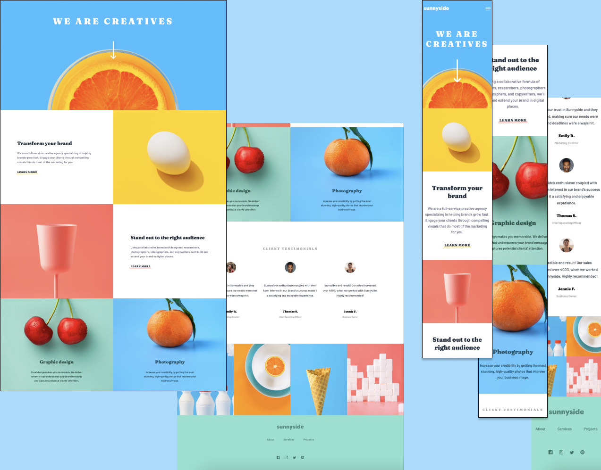

# Frontend Mentor - Sunnyside agency landing page

This is my solution to the Sunnyside landing page

## Table of contents

- [Overview](#overview)
  - [Screenshot](#screenshot)
  - [Links](#links)
- [My process](#my-process)
  - [Built with](#built-with)
  - [What I learned](#what-i-learned)
  - [Continued development](#continued-development)
- [Author](#author)

## Overview

- View the optimal layout for the interface depending on their device's screen size
- See hover and focus states for all interactive elements on the page
- Toggle the mobile menu.

### Screenshot

#### Desktop and mobile versions of layout

### Links

- Live Site URL: https://sunnside-landing-nadiafr.netlify.app/

## My process

### Built with

- Semantic HTML5 markup
- SASS architecture (sass variables, @mixins ..)
- Flexbox
- Grid

### What I learned

- SASS architecture for landing page, with separate files for every section.
- Use breakpoint mixins and SASS map to apply screen width
- Applying svg icons with different collor-fill on hover state

### Continued development

Apply SASS on more complexe layout. Integrate more JS

## Author

Nadia Furzikova - front-end developer,
based 📍 Nancy/France
